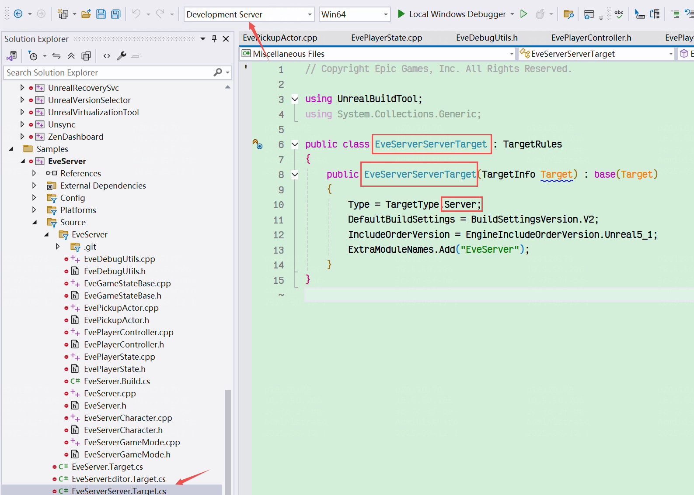
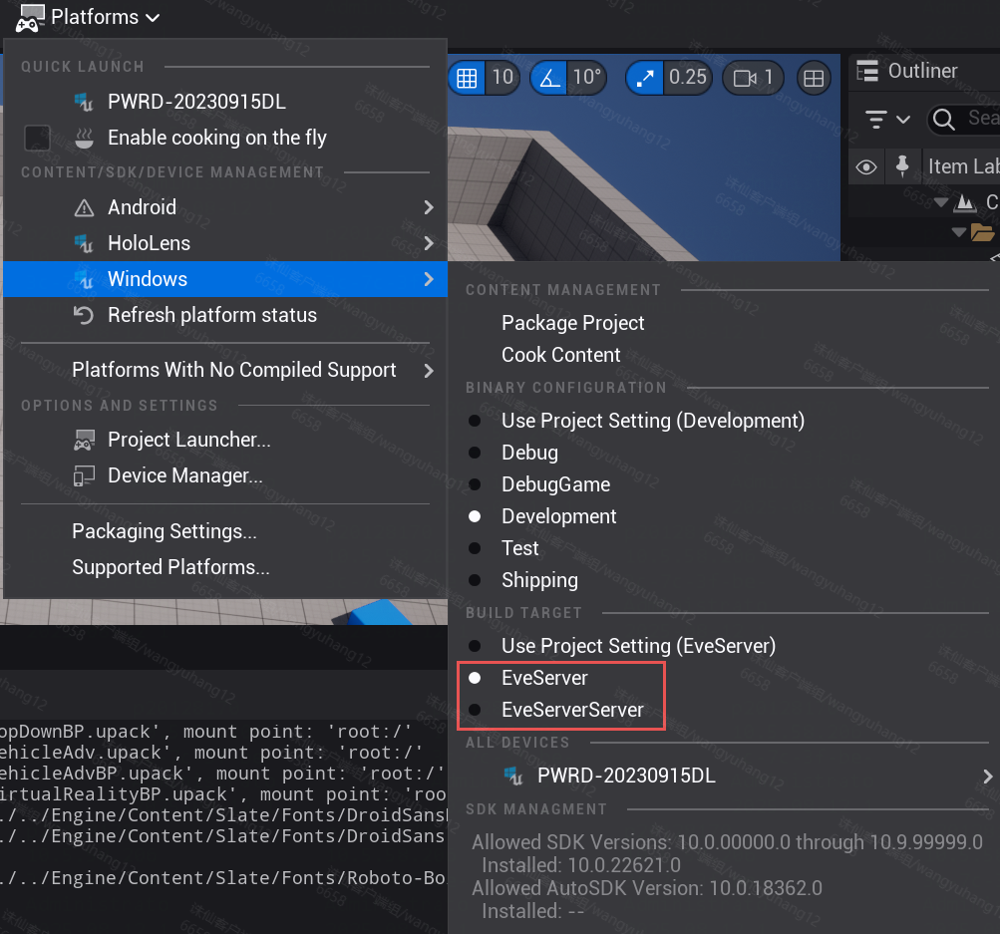
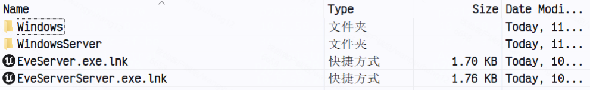
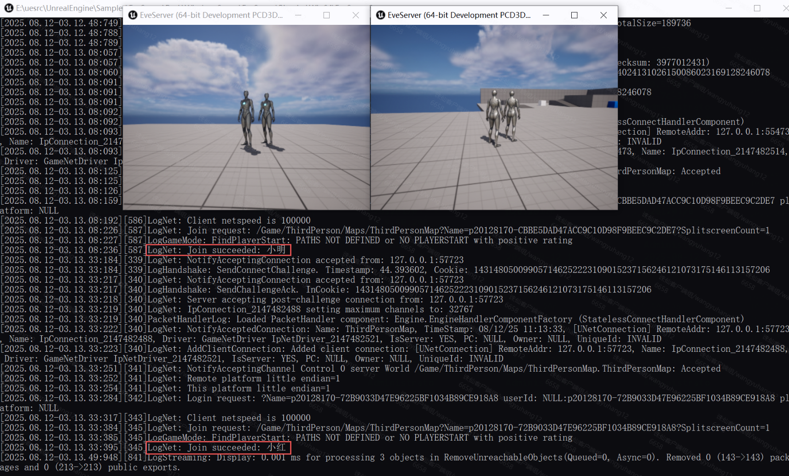
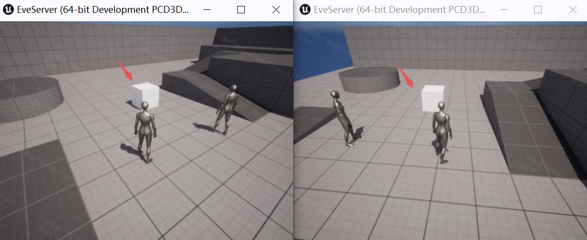
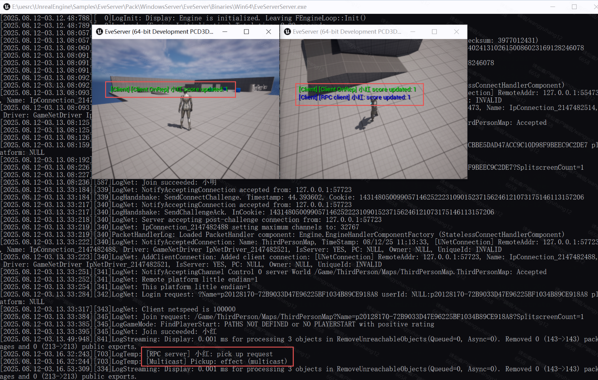
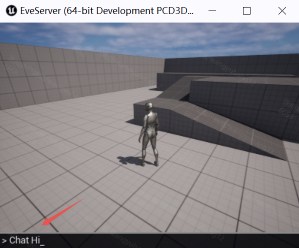
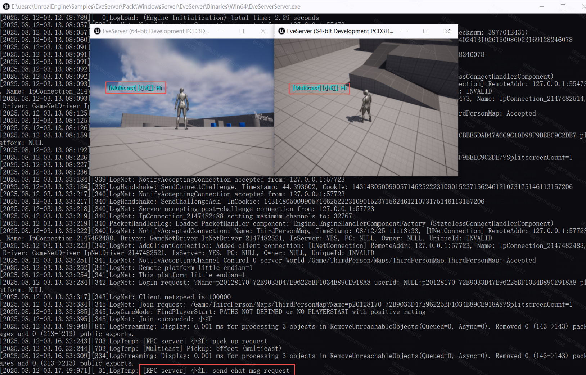

这是一个Dedicated Server的最小工程Demo，包含UE5专用服务器和客户端通信的全部基础功能和流程。

### 总体类关系

- `AEveGameMode`——把默认类设为我们的 Controller/PlayerState/GameState（也可直接在 ProjectSettings 里改）。
- `AEvePlayerController`（继承 `APlayerController`）——**客户端发起 Server RPC** 的入口（例如按 E 尝试拾取），并包含 `Server_SendChatMessage`（演示 Server RPC + 后续广播）。
- `AEvePlayerState`（继承 `APlayerState`）——保存并复制 `Score`，带 `OnRep` 更新 UI。
- `AEveGameState`（继承 `AGameStateBase`）——包含 `NetMulticast` 的广播方法（多人聊天示例）。
- `AEvePickupActor`（继承 `AActor`）——地图中放置的拾取物（server 掌控其销毁与效果），实现 `HandlePickup`（server-only），并用 `NetMulticast` 播粒子/音效。

### 基础功能

- **拾取物品（客户端 Input -> Rpc 请求 C2S）**
- **计分（Server 修改 PlayerState -> PlayerState replicated / OnRep，Rpc通知S2C）、广播消息（Server -> GameState NetMulticast -> 所有客户端）**
- **聊天室广播** **Chat**、**NetMulticast**

### 示例图

源码环境下，额外编译Development Server，添加xxxServer.Target.cs。

分别编译客户端和服务器版本，其中需要给客户端单独设置ClientMap地图，服务器设置ServerMap。

并在客户端关卡蓝图中OpenMap(127.0.0.1)本地测试。

即游戏开始时，客户端加入服务器地图。

服务器快捷方式添加-log，打开后。客户端开启2个实例，参数添加-WINDOWED -ResX=400 -ResY=300。

如图所示，服务器log中看到2个角色（小明、小红）分别Join succeeded。

服务器场景中提前摆好AEvePickupActor的蓝图子类。

操作小红拾取物品后，可见服务器控制台log，小红发出pick up request，服务器的AEvePickupActor也打印log。

随后2个客户端屏幕上，收到了小红计分 +1 的 log。

- RPC S2C的log，只有小红收到。（仅发送给小红）
- OnRep的log，小明和小红都收到了。（UE自动广播）

符合预期。

测试Chat聊天室功能。

继续操作右边小红发送chat msg request，可见服务器收到的log显示。

屏幕聊天室广播可见，小红发送到内容。

符合预期。